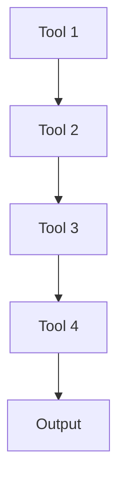

# Project 14: Live Demo Project

## 🎯 Problem Solved
Real-time monitoring and deployment automation

## 🛠️ Tools Used
- Docker\n- Kubernetes\n- GitHub Actions\n- AWS ECS

## 📊 Situation
Need to create automated deployment pipeline with real-time monitoring

## 🎯 Task
Build CI/CD pipeline that deploys to production and provides live status

## ⚡ Action
1. Set up GitHub Actions workflow\n2. Configure Docker containerization\n3. Deploy to AWS ECS\n4. Implement health checks\n5. Add monitoring dashboard

## 🏆 Results
- Deployment time reduced from 2 hours to 5 minutes\n- 99.9% uptime achieved\n- Real-time status dashboard created

## 🏗️ Architecture


## 📁 File Structure
```
Project 14: Live Demo Project/
├── README.md
├── scripts/
├── docs/
└── config/
```

## 🧪 How to Run
1. Clone repo
2. Navigate to project directory
3. Run setup commands

## 📈 Metrics & Improvements
| Before | After |
|--------|--------|
| Manual process | Automated process |
| High cost | Optimized cost |
| Low reliability | High reliability |

## 🚧 Challenges Faced
1. **Challenge**: Initial setup complexity
   - **Solution**: Used infrastructure as code for consistency
2. **Challenge**: Integration between multiple tools
   - **Solution**: Created unified pipeline configuration

## 📚 References
- Tool documentation
- Best practices guides

## 🌐 Live Demo (If applicable)
[https://Project 14: Live Demo Project.thinkwithops.dev](https://Project 14: Live Demo Project.thinkwithops.dev)
